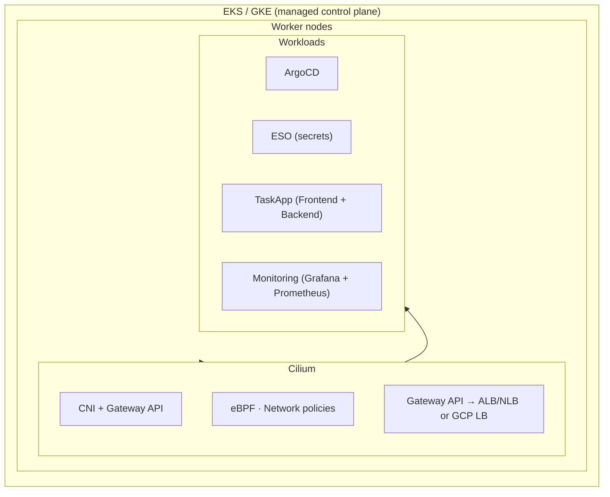

# Kubernetes DevSecOps Portfolio Project

A production-grade Kubernetes platform using **modern cloud-native stack**: managed Kubernetes (AWS EKS or Google GKE), **Cilium** (CNI + Gateway API), **Gateway API** for ingress, GitOps (ArgoCD), and observability.


## Architecture Overview

Target: **AWS EKS** or **Google GKE**. Load balancing and ingress are handled by the cloud provider and **Gateway API** (implemented by Cilium).



<details>
<summary>Image formats in Markdown</summary>

- **Mermaid** (above): Renders on GitHub; keep diagrams as code in the repo.
- **PNG / JPEG**: Use `` for screenshots or exported diagrams; works everywhere.
- **SVG**: Vector and scalable, but GitHub does not render SVG inline in markdown for security reasons—link to the file or use PNG for READMEs.
</details>

## Default Language

**Go** is the default language for this project. New code, tooling, and IaC (Pulumi) use Go unless another language is required (e.g. YAML for Kubernetes, React for the frontend).

## Technology Stack

| Category | Technology | Purpose |
|----------|------------|---------|
| **Cloud / Orchestration** | AWS EKS or Google GKE | Managed Kubernetes |
| **Infrastructure as Code** | Pulumi (Go) | EKS/GKE, VPC, and supporting resources |
| **CNI & Gateway API** | Cilium | eBPF networking, network policies, Gateway API (replaces legacy Ingress controllers and MetalLB) |
| **Ingress / L7** | Gateway API | Standard HTTP routing (implemented by Cilium); cloud LB for external traffic |
| **Certificate Management** | cert-manager | Automated TLS certificates |
| **Secrets Management** | AWS Secrets Manager / GCP Secret Manager | Cloud-native secrets storage |
| **Secrets Sync** | External Secrets Operator | Cloud secrets → Kubernetes Secrets |
| **GitOps** | ArgoCD | Declarative continuous delivery |
| **Monitoring** | Prometheus & Grafana | Metrics and dashboards |

## Features Demonstrated

- **Managed Kubernetes (EKS/GKE)** – No self-managed control plane; Pulumi provisions the cluster.
- **Cilium** – Single CNI + Gateway API implementation (eBPF, observability, L7 policies).
- **Gateway API** – HTTPRoutes and Gateways instead of legacy Ingress; cloud-native load balancing.
- **GitOps** – ArgoCD syncs `kubernetes/` from this repo.
- **Secrets** – AWS Secrets Manager (EKS) or GCP Secret Manager (GKE) + External Secrets Operator; no secrets in Git.
- **Observability** – Prometheus & Grafana.

## Project Structure

```
k8s-infra/
├── pulumi/                     # IaC (Go): multi-cloud EKS or GKE
│   ├── main.go                 # cloud=aws → EKS; cloud=gcp → GKE
│   ├── go.mod
│   ├── Pulumi.dev.yaml         # EKS stack
│   └── Pulumi.gke.yaml         # GKE stack
├── kubernetes/
│   ├── apps/                   # Application manifests
│   │   ├── namespace.yaml
│   │   ├── frontend.yaml
│   │   ├── backend.yaml
│   │   ├── gateway.yaml           # Gateway API: Gateway (Cilium)
│   │   ├── httproute.yaml        # Gateway API: HTTPRoute for TaskApp
│   │   ├── external-secret-aws.yaml  # ESO: AWS Secrets Manager → taskapp-secrets
│   │   └── external-secret-gcp.yaml  # ESO: GCP Secret Manager → taskapp-secrets
│   ├── core/
│   └── monitoring/
├── argocd/
│   └── applications/
├── application/
└── docs/
```

## Quick Start

### Prerequisites

- AWS CLI (for EKS) or gcloud (for GKE) with credentials
- [Pulumi CLI](https://www.pulumi.com/docs/install/) and Go 1.21+
- kubectl, Helm

### 1. Create cluster (EKS or GKE)

**AWS EKS** (default): use stack `dev` and `k8s-infra:cloud: aws` in `pulumi/Pulumi.dev.yaml`.

**Google GKE**: use stack `gke` and set `k8s-infra:cloud: gcp` and `gcp:project` (see `pulumi/Pulumi.gke.yaml`).

```bash
cd pulumi
go mod tidy
pulumi up
# Then configure kubectl from output:
# AWS: pulumi stack output updateKubeconfigCommand
# GCP: pulumi stack output getCredentialsCommand
```

See [pulumi/README.md](pulumi/README.md) for config and stack setup (EKS vs GKE).

### 2. Install Cilium (CNI + Gateway API)

If the cluster does not use Cilium by default (e.g. EKS with default CNI), install Cilium for Gateway API and optional network policies:

```bash
helm repo add cilium https://helm.cilium.io/
helm install cilium cilium/cilium --namespace kube-system \
  --set gatewayAPI.enabled=true
# Install Gateway API CRDs if not present
kubectl apply -f https://github.com/kubernetes-sigs/gateway-api/releases/download/v1.0.0/standard-install.yaml
```

### 3. Deploy platform services

```bash
# cert-manager
kubectl apply -f https://github.com/cert-manager/cert-manager/releases/download/v1.13.0/cert-manager.yaml

# External Secrets Operator (syncs AWS Secrets Manager / GCP Secret Manager → K8s Secrets)
helm install external-secrets external-secrets/external-secrets -n external-secrets-system --create-namespace

# Prometheus & Grafana
helm install prometheus prometheus-community/kube-prometheus-stack -n monitoring --create-namespace

# ArgoCD
kubectl create namespace argocd
kubectl apply -n argocd -f https://raw.githubusercontent.com/argoproj/argo-cd/stable/manifests/install.yaml
```

### 4. Configure cloud secrets and deploy app

**AWS (EKS):** Create a secret in [AWS Secrets Manager](https://console.aws.amazon.com/secretsmanager/) (e.g. name `taskapp/config`) with keys `DB_PASSWORD`, `API_KEY`, `JWT_SECRET`, or store a JSON object. Configure ESO with a [ClusterSecretStore for AWS](kubernetes/apps/external-secret-aws.yaml) (IRSA recommended). Apply the ExternalSecret that syncs it to `taskapp-secrets`.

**GCP (GKE):** Create a secret in [GCP Secret Manager](https://console.cloud.google.com/security/secret-manager) (e.g. `taskapp-config`) with the same keys. Configure ESO with a [ClusterSecretStore for GCP](kubernetes/apps/external-secret-gcp.yaml) (Workload Identity recommended). Apply the ExternalSecret that syncs it to `taskapp-secrets`.

Then deploy the app via ArgoCD (syncs `kubernetes/apps` including Gateway API and ExternalSecret manifests):

```bash
kubectl apply -f argocd/applications/taskapp.yaml
```

## Accessing Services

With EKS: the Cilium Gateway creates an AWS Load Balancer (ALB/NLB). The exact URL depends on the LB hostname or custom domain you configure. With GKE, the Gateway will use a GCP Load Balancer.

| Service | How to access |
|---------|----------------|
| Task Application | Via Gateway API HTTPRoute; host/URL from Gateway status or LB |
| ArgoCD | `kubectl port-forward svc/argocd-server -n argocd 8080:443` then https://localhost:8080 |
| Grafana | `kubectl port-forward -n monitoring svc/prometheus-grafana 3000:80` |

## Secrets Flow

**AWS:** AWS Secrets Manager → External Secrets Operator → K8s Secret (`taskapp-secrets`) → Pods (envFrom)

**GCP:** GCP Secret Manager → External Secrets Operator → K8s Secret (`taskapp-secrets`) → Pods (envFrom)

## GitOps

ArgoCD watches this repo and syncs `kubernetes/apps` (using `kubernetes/apps/kustomization.yaml` as the EKS-focused bundle).

For commit-based image updates, the GitHub Actions workflow `.github/workflows/gitops-frontend.yml` builds `application/frontend`, pushes the image, and commits a new `kustomization.yaml` `newTag` so Argo CD can roll the change out.

## Documentation

- [Architecture](docs/architecture.md) – Cilium, Gateway API, EKS/GKE design
- [Pulumi](pulumi/README.md) – Config, EKS vs GKE, outputs

## License

This project is licensed under the MIT License - see the [LICENSE](LICENSE) file for details.
